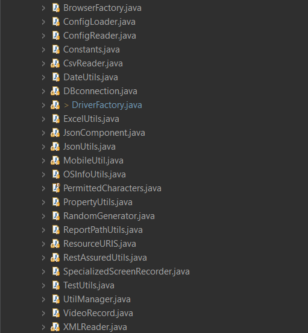

# QO-BOX-WEB-BDD-FRAMEWORK

>***This hybrid bdd framework is a comprehensive testing solution designed to support various testing methodologies, including BDD (Behavior Driven Development approach), data-driven, and keyword-driven test automation. This framework is uniquely equipped to handle testing across diverse interfaces, including Web UI. Additionally, it incorporates the robust Page Object Model (POM) architecture, ensuring a modular and maintainable structure. This unified approach allows seamless testing across different platforms and interfaces, providing a versatile solution for software testing that promotes efficiency and collaboration across development and testing teams.***

<h3>Framework Tools Tech Stack</h3>

>*1. Programming Language – Java (JDK 17).*

>*2. Major Tools – Selenium ( 4.15.0 ).*

>*3. Supporting Tools – Apache POI, JSON, Open CSV, Screenshot, Video Recorder​.*

>*4. Data Driven - Excel, CSV, JSON, XML, and properties files.*

>*5. BDD – Cucumber with Java​ (7.14.1).*

>*6. Maven - Easy Build & and dependencies management​ ( Maven Compile plugin - 3.11.0 ).*

>*7. TestNG (7.8.0)-  Control test executions, assertions, data providers, listeners, retries, etc.*

>*8. Reports – Cucumber Reports, Extent Report (5.1.1) & Allure Reports (2.25.0).*

**Framework Architecture:**

<table border: 1px solid black>
  <tr>
    <th><b>Commonly Used Test Libraries<b></th>
    <th><b>Required Main Libraries<b></th>
  </tr>
  <tr>
    <td>1. Feature File</td>
    <td>1. Utilities</td>
  </tr>
  <tr>
    <td>2. Step Definition</td>
    <td>2. Listeners</td>
  </tr>
<tr>
    <td>3. Pages or Screens</td>
    <td>3. Hooks</td>
  </tr>
  <tr>
    <td>4. Runner file</td>
    <td>4. Reports</td>
  </tr>
</table>

>>

><h5><i>src/main/java:</i></h5>

>>

><h5><i>src/test/java:</i></h5>

>>

><h5><i>src/test/resources:</i></h5>

>>

><h5><i>Execution Reports / outputs:</i></h5>

>>

>>

<hgroup>
<h3>Setting up the Run Configurations</h3>
	<em font-size=20px>Illustrating how to setup the run configurations for a project</em>
</hgroup>

>**STEP 1 : Open Run Configurations in Eclipse**
>>*1. Open any existing file* 
>>*2. Right click on the file*   
>>*3. click on run as*   
>>*4. click on run configuration*   

>>

>**STEP 2 : Double click on Maven build**
>>

>**STEP 3 : Select your workspace:**
>>

>**STEP 4 : Choose your project:**
>>

>**STEP 5 : Add Goals:**
>>*Example: test verify*  
>>

>**STEP 6 : Go to JRE:**
>>

>**STEP 7 : Add VM Aruguments:**
>>*Examples:*

>>>*WEB_UI*
>>>><i>-DBrowser="Chrome" -DexecType=Web_UI -DsuiteXmlFile=Web_UI_Testng.xml -Dcucumber.filter.tags=@Demo<i>

>>

>**STEP 8 : Click on Apply & Click on Run**
>>*

<h3>Implementations</h3>

><h4>Utilities</h4>

>>*These classes serve various functions such as initializing drivers, triggering events in listeners, implementing data-driven testing by reading and writing data between Excel and databases. They also facilitate tasks like zipping the ExtentReports directory into the project path (allowing it to be sent as an email attachment), automatically opening the report post-test execution, enabling cross-browser testing with parallel browser instances, and incorporating custom annotations*

>>
>>

<h3>Reports & Additional features</h3>

><h4>1. Allure Reports</h4>

>>*1.1. To generate Allure report, Add allure dependency and add plugin in @Cucumberoptions*  

>>  

>>*1.2. Refer this, https://docs.qameta.io/allure/*  
>>*1.3. Go to your project location* 
>>*1.4. Open command prompt, type allure serve allure-results provide allure reports path*  

><h4>2. Cucumber Reports</h4>

>>*2.1. To generate cucumber report, add plugin in @Cucumberoptions* 

>> 

>>*2.2. Go to the target\site\cucumber-pretty* 

>> 

>>*2.3. Upon the completion of your execution, review the console output to identify any links that are highlighted in red color.*  

>> 

>>*2.4. Navigate to the particular report url* 

>> 

><h4>3. Extent Reports</h4>

>>*3.1. Upon the completion of your execution, go to the project directory, you'll find Execution Reports Folder.*  
>>*3.2. Open the Execution Reports Folder, You will find appropriate Extent Reports.*  
>>*3.3. Click on any report, it will open in your default browser.*  

><h4>4. Screen Shots</h4>

>>*4.1. Upon the completion of your execution, go to the project directory, you'll find ScreenShots Folder.*  
>>*4.2. Open the ScreenShots Folder, You will find appropriate screenshots captured on test failure.*  

><h4>5. Video Recordings</h4>

>>*4.1. Upon the completion of your execution, go to the project directory, you'll find VideoRecordings Folder.*  
>>*4.2. Open the VideoRecordings Folder, You will find appropriate recorded videos.*  

<h3>Jenkins Configuration</h3>

>*1. Download the jenkins.war file*  
>*2. Navigate to the directory where the Jenkins.war file is located*  
>*3. Clear the address bar in File Explorer, type "cmd," and press Enter.*  
>*4. pass below cmd line in cmd and press enter*  

>><i>java -Dhudson.model.DirectoryBrowserSupport.CSP="default-src * 'unsafe-inline' 'unsafe-eval'; script-src * 'unsafe-inline' 'unsafe-eval'; connect-src * 'unsafe-inline'; img-src * data: blob: 'unsafe-inline'; frame-src *; style-src * 'unsafe-inline';" -jar jenkins.war</i>  

>*5. Navigate to localhost:8080*  
>*6. If already having an account, sigin to jenkins*  
>*7. Create a Job*  

>  

>  

**License**  
				
*1. This framework is solely designed for the exclusive use of QO BOX and its clients.*  
*2. Strictly refrain from sharing it with external parties.*  
*3. The framework is to be securely maintained and accessible solely to client-employees.*  
*4. It is crucial to exercise due diligence in safeguarding the framework to prevent any unauthorized use or disclosure to third parties.*  
*5. In the event of any security concerns or breaches, promptly report and address the issues following the company's security protocols.*  

***Copyright @ QO BOX Pvt Ltd.***
